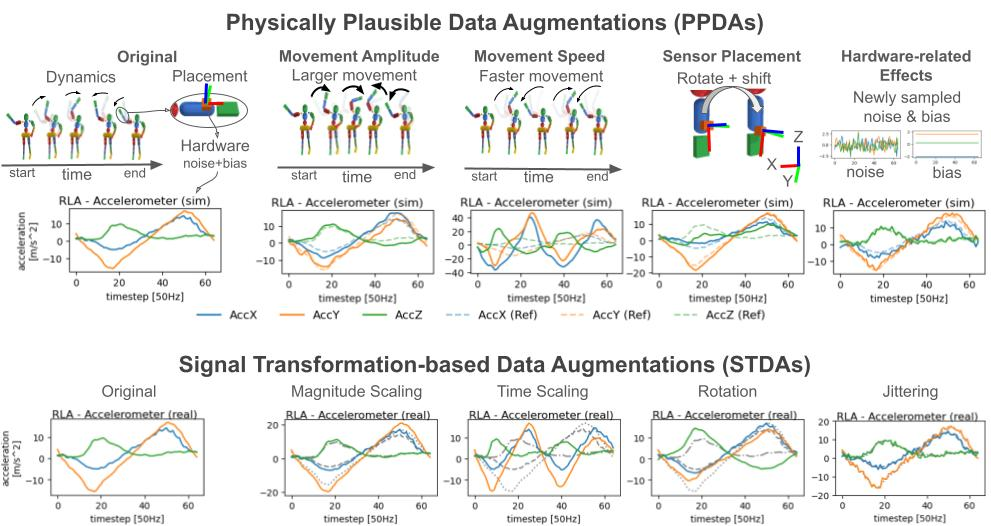

# Physically Plausible Data Augmentations for Wearable IMU-based HAR

This repository contains the implementation of **Physically Plausible Data Augmentation (PPDA) for wearable Inertial Measurement Unit (IMU)-based Human Activity Recognition (HAR)**

[📄 Read our paper (arXiv)](https://arxiv.org/abs/XXXX.XXXXX)  

---



*Figure: PPDAs introduce physically plausible variations in wearable IMU data using physics simulation, compared to conventional STDAs which directly apply signal transformations.*

## 📌 Introduction

This repository provides the official implementation of **Physically Plausible Data Augmentation (PPDA)** for **wearable IMU-based Human Activity Recognition (HAR)**. PPDA uses the WIMUSim physics simulation framework to generate realistic variations in:

- **Movement Amplitude**
- **Movement Speed**
- **Sensor Placement**
- **Hardware-related Effects** (noise and bias)

These augmentations help improve model generalization and reduce the need for large-scale labeled data collection, compared to traditional **Signal Transformation-based Data Augmentations (STDAs)**.


## ⚙️ Installation

### Prerequisites
- Python 3.10 or higher
- Git

1. **Clone this repository and WIMUSim repository**  
```bash
git clone https://github.com/USERNAME/PPDA.git
git clone https://github.com/STRCWearlab/WIMUSim.git
cd PPDA
```

2. Install dependencies
```bash
% 
pip install -e WIMUSim
pip install -r requirements.txt
```

3. Configure environment variables
Set the `WANDB_ENTITY` environment variable to your Weights & Biases entity name.
```text
WANDB_ENTITY=`replace_with_your_wandb_entity`
```

3. Prepare datasets
Download datasets (REALDISP, REALWORLD, MM-Fit) as described in [data/README.md](data/README.md).

## 🧪 Quick Start: Sample Script
<!-- Include sample script -->

## 📚 Citation
<!-- Include bibtex info -->

## 🔗 Links


## 🙏 Acknowledgements

Parts of this repository are adapted from  
[dl_har_public](https://github.com/STRCSussex-UbiCompSiegen/dl_har_public).  
We thank the authors for making their code available.

